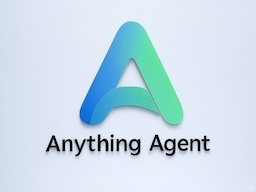
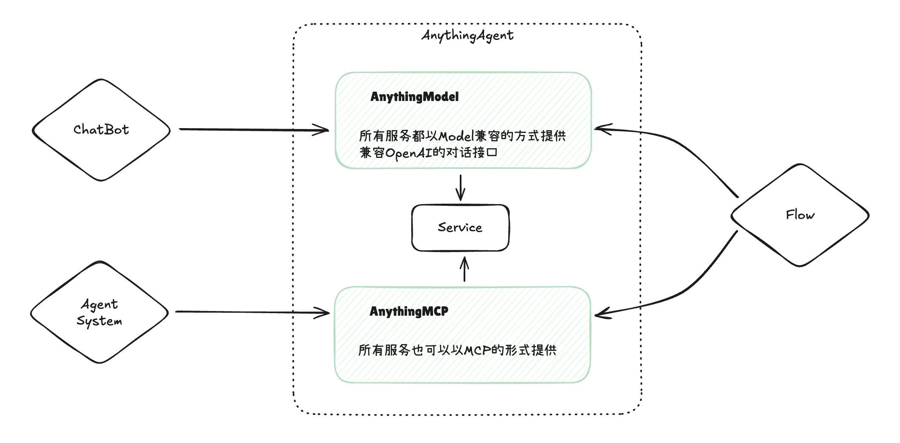

# AnythingAgent

**Turn Anything into an Agent**




The idea of AnythingAgent is simple: turn all application functionalities into agents. Using any functionality becomes as simple as chatting.

English | [简体中文](README_cn.md)

AnythingAgent serves external systems (such as chatbots, intelligent agents, AI process control systems, etc.) through two interface forms: AnythingModel and AnythingMCP. The API design is fully compatible with OpenAI API, enabling seamless integration with most AI applications.



## Key Features

- OpenAI Compatible: API endpoints and request formats are fully compatible with OpenAI, supporting direct replacement
- File Management System: Supports uploading, downloading, and managing various file formats, with API formats consistent with OpenAI's file management interface
- API Key Authentication: Uses the same Bearer Token authentication mechanism as OpenAI
- Asynchronous Processing: High-performance asynchronous processing based on FastAPI
- Vector Storage: Efficient vector storage and retrieval using LanceDB
- Model Encapsulation: Seamless integration from application to model through simple AnythingBaseModel
- Model Management: Unlimited model expansion through simple model management interface
- Compatible with Various ChatUIs: Supports various ChatUIs like Streamlit, Gradio, Flask, etc.
- Virtual Environment: Each model runs in an independent virtual environment, without interference

## Development Roadmap

- [x] Implement OpenAI-compatible API interface
- [x] Implement model specification
- [x] Implement model deployment management
- [ ] Support messages containing images and files
- [ ] Implement proxy models for various LLMs
- [ ] Implement a set of basic models
- [ ] Implement MCP interface
- [ ] Implement permission management
- [ ] Implement user and key management

## Quick Start

### Install Dependencies

```bash
pip install -r requirements.txt
```

### Configuration

Configure necessary parameters in the `.env` file:

```env
# API Configuration
ENABLE_API_KEY=false
API_KEY=your-api-key

# File Configuration
MAX_FILE_SIZE=52428800

# Model Configuration
MODEL_DIR=models
```

### Start the Service

```bash
uvicorn app.main:app --host 0.0.0.0 --port 8000 --reload
```

### Model Development

Create a new folder like `models/my_model`, then create a file `main.py`. Implement a model by inheriting from the AnythingBaseModel class and implementing the `on_chat_message` method.

```python
class MyModel(AnythingBaseModel):
    def on_chat_message(self, message: str, callback: Callable):
        # Process message
        callback(message)
```

### Model Deployment

Copy the developed model folder, such as `models/my_model`, to the `models` directory.

### Model Management

Model management is achieved through a simple model management interface, allowing unlimited expansion.

## API Usage Instructions

All API endpoints and request formats are consistent with the OpenAI API, allowing direct use of various OpenAI API client libraries with only the base URL modified.

### Supported File Types

- Documents: pdf, doc, docx, xls, xlsx, ppt, pptx
- Images: jpg, jpeg, png, gif, bmp, webp, svg
- Text: txt, json, csv, md, yaml, yml

## Development Instructions

The project is developed using Python 3.10+ with the following main dependencies:

- FastAPI: Web framework
- LanceDB: Vector database
- Pydantic: Data validation
- aiofiles: Asynchronous file operations

API documentation access:
- Swagger UI: http://localhost:8000/v1/docs
- ReDoc: http://localhost:8000/v1/redoc 

## License

This project is licensed under the Apache License 2.0 - see the LICENSE file for details.
